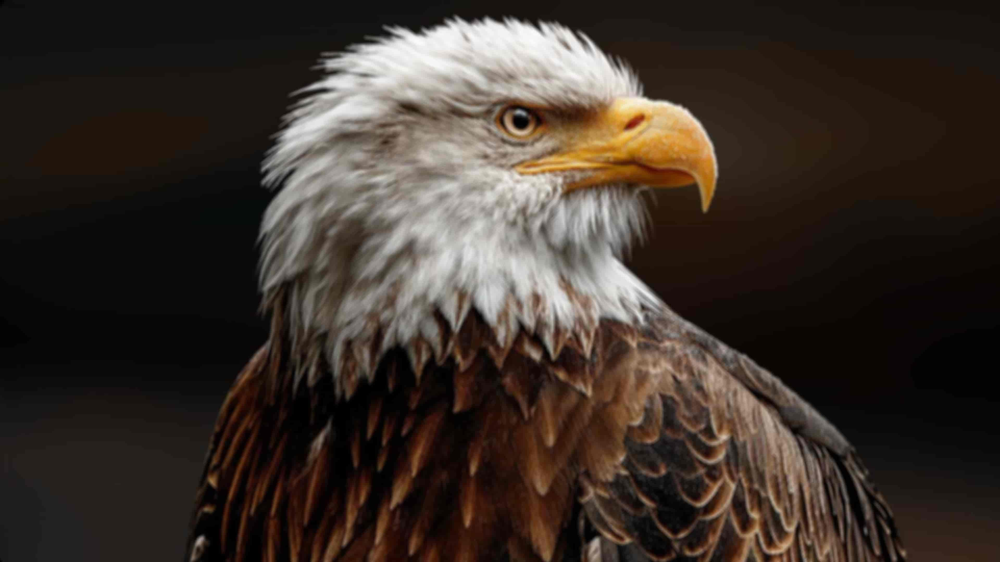
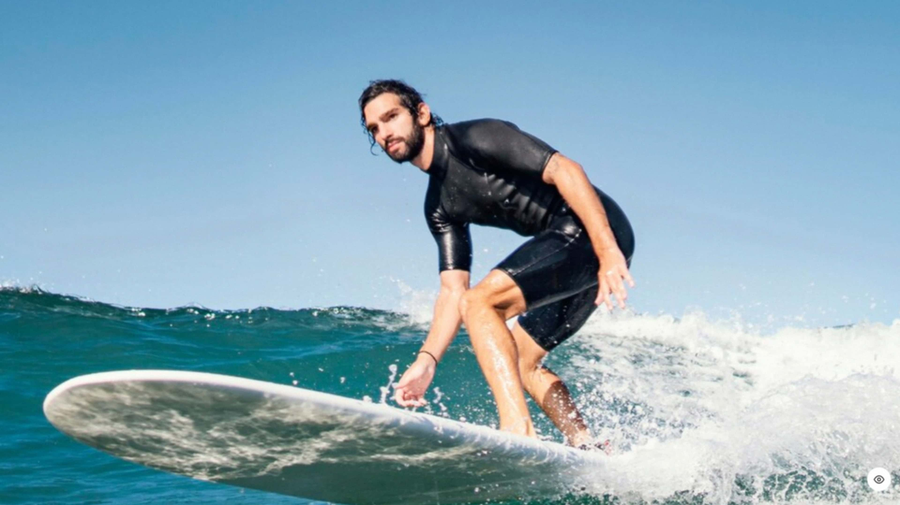

# HitPaw Enhancement API SDK

Official Python SDK for HitPaw AI Image and Video Enhancement APIs.

[](https://pypi.org/project/hitpaw-upscale-api/)
[](https://pypi.org/project/hitpaw-upscale-api/)
[](https://pypi.org/project/hitpaw-upscale-api/)

---

## Features

- 🖼️ **Image Enhancement** - Upscale images 2x/4x with AI super-resolution
- 🎬 **Video Enhancement** - Upscale videos up to 4K with temporal stability  
- 👤 **Portrait Enhancement** - Face restoration and beautification
- 🧹 **Denoise & Restore** - Remove noise, blur, and compression artifacts
- 🎨 **Generative Models** - AI reconstruction for severely degraded content

---

## Installation

```bash
pip install hitpaw-upscale-api
```

Or install from source:

```bash
git clone https://github.com/HitPaw-Official/HitPaw-Enhancement-API-SDK.git
cd HitPaw-Enhancement-API-SDK
pip install -e .
```

---

## Quick Start

```python
from hitpaw_upscale_api import HitPawUpscaleAPI, ImageModel, VideoModel

# Initialize with your API key
client = HitPawUpscaleAPI(api_key="your_api_key")

# Image Enhancement
result = client.enhance_image_and_wait(
    img_url="https://example.com/photo.jpg",
    model_name=ImageModel.GENERAL_2X,
    extension=".jpg"
)
print(f"Enhanced image: {result['res_url']}")

# Video Enhancement
result = client.enhance_video_and_wait(
    video_url="https://example.com/video.mp4",
    model_name=VideoModel.GENERAL_RESTORE_2X,
    resolution=[1920, 1080]
)
print(f"Enhanced video: {result['res_url']}")
```

---

## API Overview

### Image Enhancement API

Our image processing services offer world-class capabilities designed to handle a wide variety of restoration scenarios:

- **Upscale**: Output high-resolution images from low-resolution input files using standard or high-fidelity models.
- **Face Recovery**: Ensure high-quality facial details, offering both "Clear" (soft/beauty) and "Natural" (textured/realistic) restoration options.
- **Sharpen & Denoise**: Bring images into focus by removing blur and sensor noise while preserving the original structure.
- **Generative Restoration**: Leverage Diffusion technology to reconstruct details in severely degraded portraits or general images.

### Video Enhancement API

Our video processing services provide industrial-grade solutions for restoring and upscaling video content:

- **Video Upscale**: Convert SD or HD footage to 4K Ultra HD clarity using deep convolution and feature learning technologies.
- **Portrait Restoration**: Specialized models to detect, stabilize, and enhance faces in video streams.
- **General Restoration**: A comprehensive solution based on GAN technology to de-noise, de-blur, and enhance details.
- **Generative Reconstruction**: Utilizing Stable Diffusion for video to reconstruct textures and details.

---

## Available Image Models

### Standard Models (Focus: Fidelity & Accuracy)

| Model | API Name | Description | Use Case |
|-------|----------|-------------|----------|
| General Enhance | `general_2x`, `general_4x` | Go-to solution for 2x/4x upscaling. Balances noise reduction with detail generation. | Social media, general photos |
| High Fidelity | `high_fidelity_2x`, `high_fidelity_4x` | Designed for high-quality inputs. Strictly preserves original artistic intent and fine textures. | Professional photography, printing |
| Portrait Clear | `face_2x`, `face_4x` | Dual-model: beautifies faces while sharpening background. | Portraits needing balance of beauty + clarity |
| Portrait Natural | `face_v2_2x`, `face_v2_4x` | V2 model prioritizing realistic skin textures (pores, grain). | Professional restoration, realism |
| Sharp Denoise | `sharpen_denoise_1x` | Aggressively removes noise while sharpening edges. 1x (no upscale). | Grainy, low-light photos |
| Detail Denoise | `detail_denoise_1x` | Removes noise while preserving original texture and details. 1x. | Artistic photos, scanned documents |

### Generative Models (Focus: Creativity & Reconstruction)

| Model | API Name | Description | Use Case |
|-------|----------|-------------|----------|
| Generative Portrait | `generative_portrait_1x/2x/4x` | Diffusion-based for human subjects. Reconstructs realistic details. | Severely degraded portraits |
| Generative Enhance | `generative_1x/2x/4x` | General-purpose Diffusion for landscapes, objects, architecture. | Low-quality general images |

---

## Available Video Models

### Restoration & Upscale

| Model | API Name | Description | Use Case |
|-------|----------|-------------|----------|
| Ultra HD | `ultrahd_restore_2x` | Deep convolution for SD/HD to 4K. Smooth edges, anti-aliasing. | 1080p → 4K upscaling |
| General Restore | `general_restore_1x/2x/4x` | GAN-based: de-noise, de-blur, enhance details. | Old clips, compressed videos |
| Portrait Restore | `portrait_restore_1x/2x` | Multi-frame fusion for face restoration in video. | Blurry faces in video |
| Face Soft | `face_soft_2x` | Face beautification with identity preservation. | Vlogs, livestreams |
| Generative Video | `generative_1x` | Stable Diffusion for impossible restoration tasks. | Heavily degraded video |

---

## Model Specifications

### Image Models

| Category | Models | Max Input | Max Output | Formats |
|----------|--------|-----------|------------|---------|
| Enhancement & Denoise | face_*, general_*, high_fidelity_*, sharpen_denoise_1x, detail_denoise_1x | 70 MP | 432 MP | bmp, jpeg, jpg, png, jfif, tga, tiff, webp, heif |
| Generative | generative_portrait_*, generative_* | 34 MP | 34 MP | bmp, jpeg, jpg, png, jfif, tga, tiff, webp, heif |

### Video Models

| Parameter | Limit |
|-----------|-------|
| Input Formats | dv, mlv, m2ts, m2t, m2v, nut, ser, 3g2, 3gp, asf, avi, divx, f4v, flv, h261, h263, m4v, mkv, mov, mp4, mpeg, mpeg4, mpg, mxf, ogv, rm, rmvb, webm, wmv, etc. |
| Output Formats | mp4, mov, mkv, m4v, avi, gif |
| Max Resolution | 36 MP (total pixels) |
| Duration | 0.5s to 1 hour |

---

## Coin Pricing

| Operation | Coins |
|-----------|-------|
| Image 2x/4x upscale | ~75 |
| Image 1x denoise | ~50 |
| Generative image | ~100+ |
| Video upscale | Varies |

---

## Examples

### Image Enhancement

#### General Enhancement (general_2x)

| Before | After |
|--------|-------|
|  |  |

#### Face Restoration (face_v2_2x)

| Before | After |
|--------|-------|
|  |  |

### Video Enhancement

Video examples coming soon. See [examples/videos/](examples/videos/) for details.

---

## Documentation

- [API Documentation](https://developer.hitpaw.com/)
- [Image API Reference](https://developer.hitpaw.com/image/API-reference)
- [Video API Reference](https://developer.hitpaw.com/video/API-reference)
- [Image Available Models](https://developer.hitpaw.com/image/available-models)
- [Video Available Models](https://developer.hitpaw.com/video/available-models)

---

## CLI Usage

```bash
# Image enhancement
python -m hitpaw_upscale_api --api-key KEY --mode image \
  --url https://example.com/image.jpg \
  --model general_2x \
  --extension .jpg \
  --wait

# Video enhancement
python -m hitpaw_upscale_api --api-key KEY --mode video \
  --url https://example.com/video.mp4 \
  --model general_restore_2x \
  --resolution 1920,1080 \
  --wait
```

---

## License

MIT License

## Support

- [Official Website](https://www.hitpaw.com/)
- [Developer Portal](https://developer.hitpaw.com/)
- [Purchase API Key](https://www.hitpaw.com/hitpaw-api.html)
