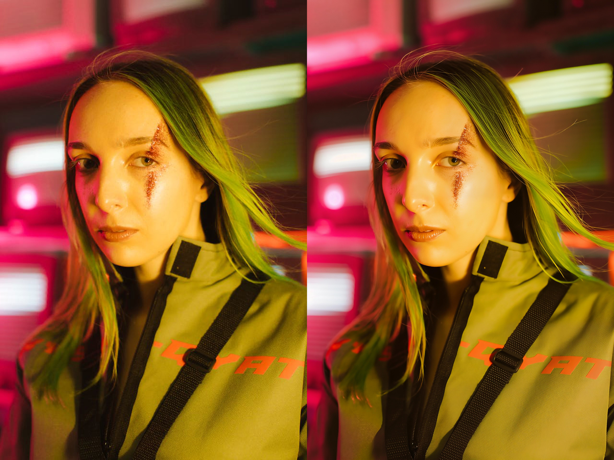
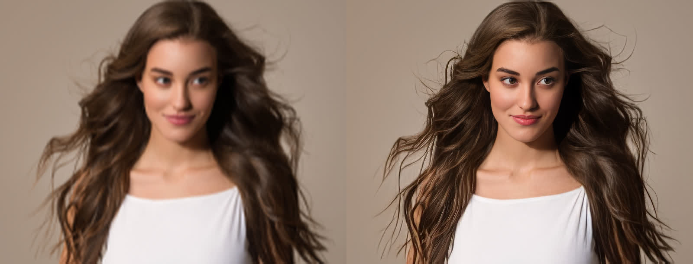
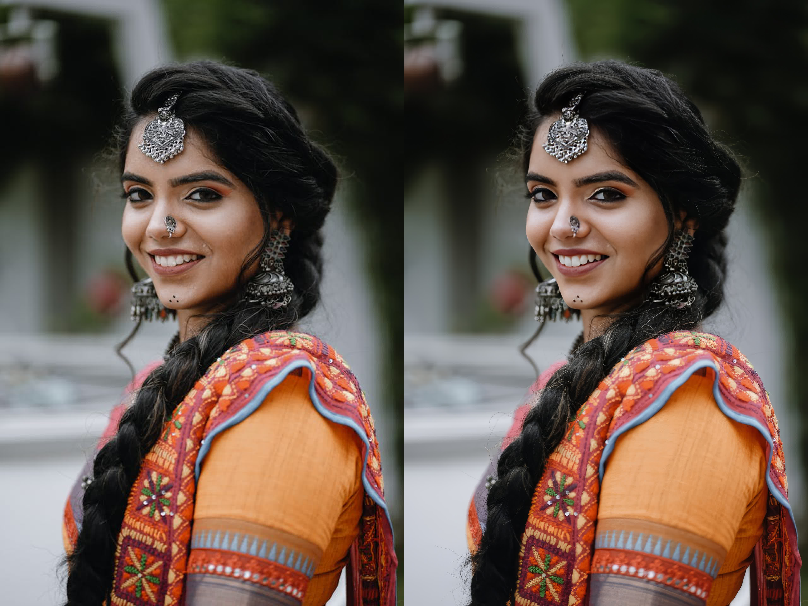
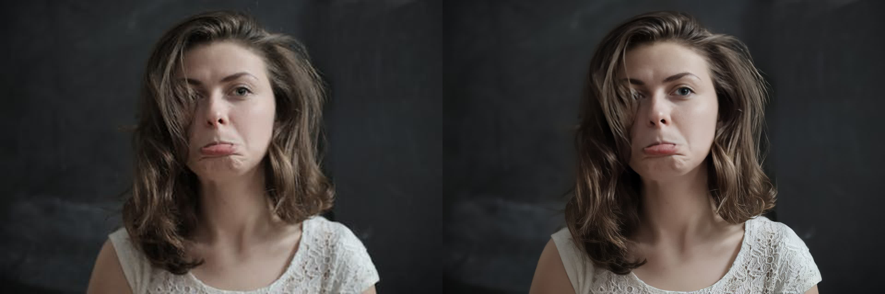
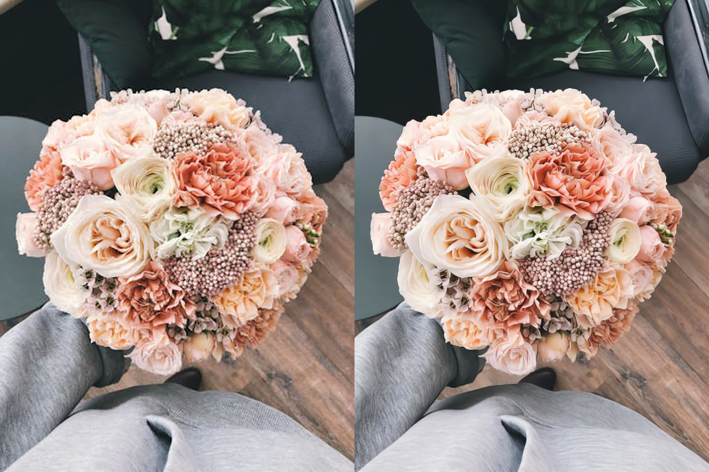
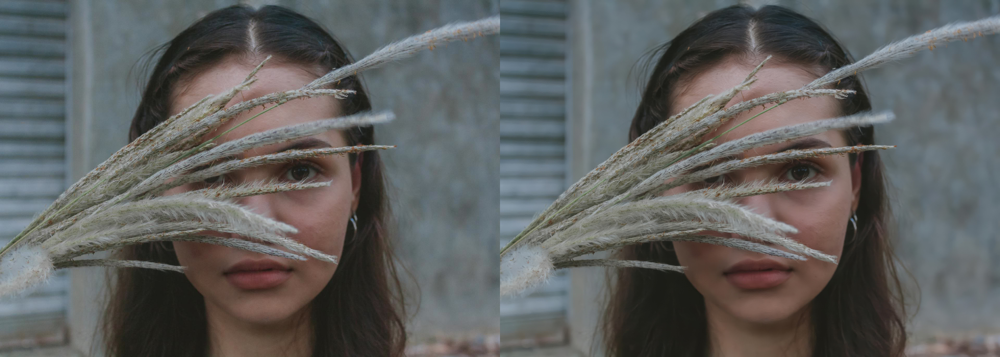
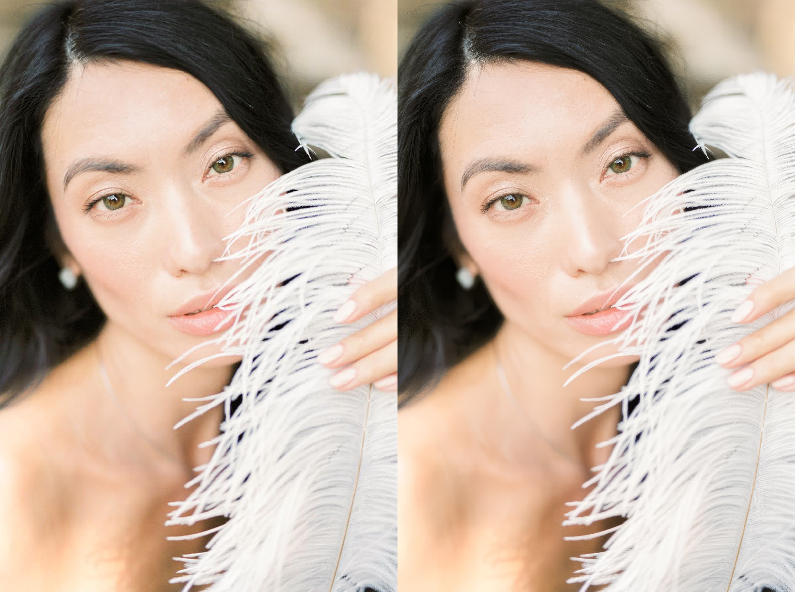
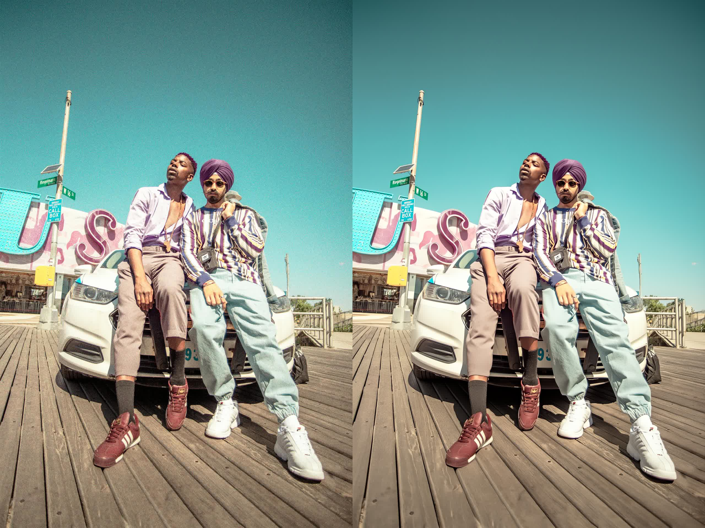
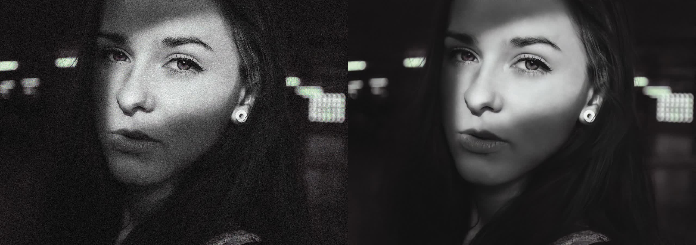

# Example Images

This directory contains comparison images for all image models (side-by-side before/after).

## Image Enhancement Examples

### 1. Generative Portrait Model

*Diffusion-based for human subjects. Best for extremely low-quality portraits.*

---

### 2. Generative Enhance Model

*Ideal for heavily compressed or low-resolution general images.*

---

### 3. Portrait Model (Clear) - 2x

*Beautifies faces while sharpening background. 2x upscale.*

---

### 4. Portrait Model (Clear) - 4x

*Beautifies faces while sharpening background. 4x upscale.*

---

### 5. Portrait Model (Natural) - 2x

*Realistic skin texture recovery. 2x upscale.*

---

### 6. Portrait Model (Natural) - 4x

*Realistic skin texture recovery. 4x upscale.*

---

### 7. General Enhanced Model - 2x

*General-purpose upscaling and enhancement. 2x upscale.*

---

### 8. General Enhanced Model - 4x

*General-purpose upscaling. 4x upscale.*

---

### 9. High Fidelity Model - 2x

*Preserves original artistic intent. 2x upscale.*

---

### 10. High Fidelity Model - 4x

*Preserves original artistic intent. 4x upscale.*

---

### 11. Sharp Denoise Model

*Aggressively removes noise while sharpening. 1x (no upscale).*

---

### 12. Detail Denoise Model

*Removes noise while preserving original texture. 1x (no upscale).*

---

*Note: These are side-by-side comparison images from the official HitPaw API documentation.*
